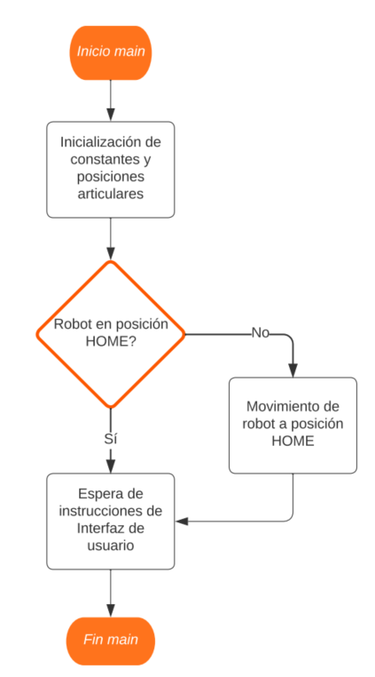
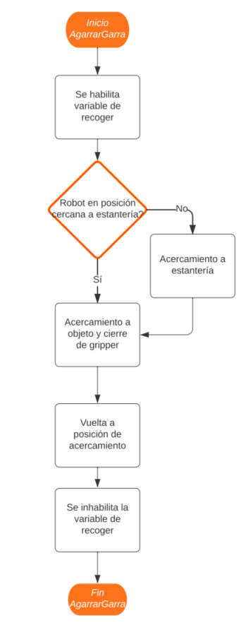
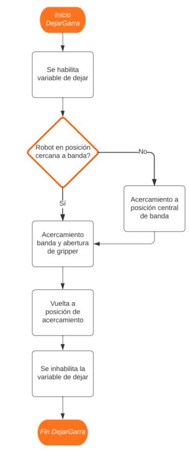
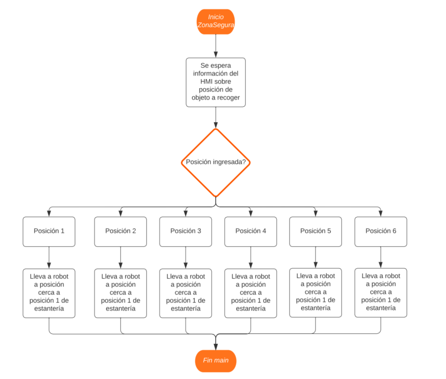
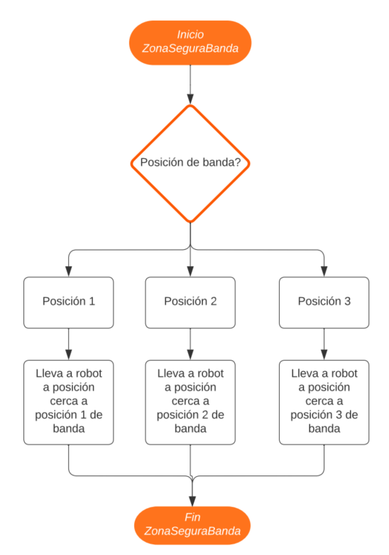
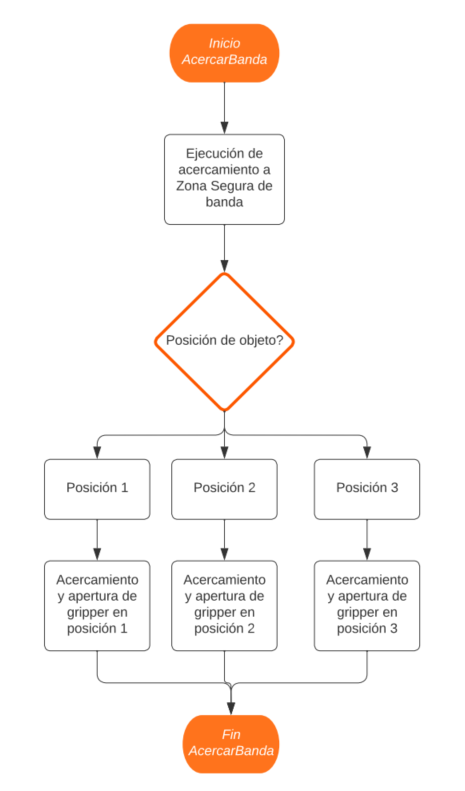
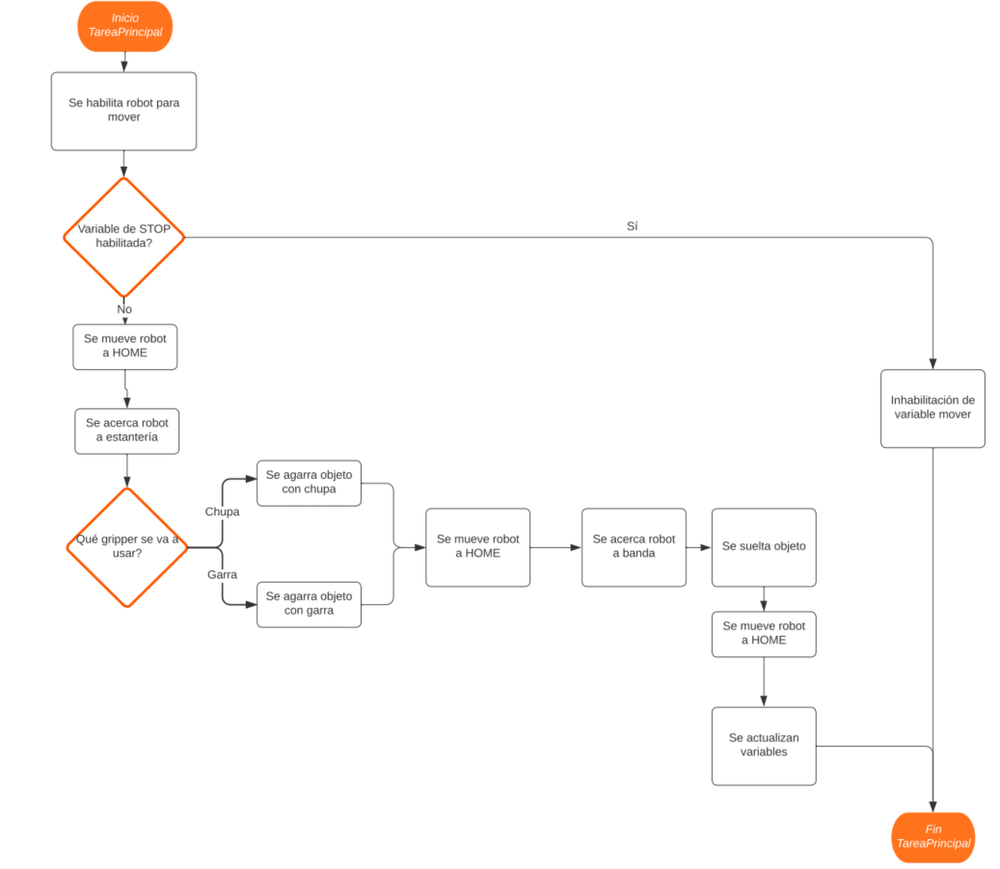
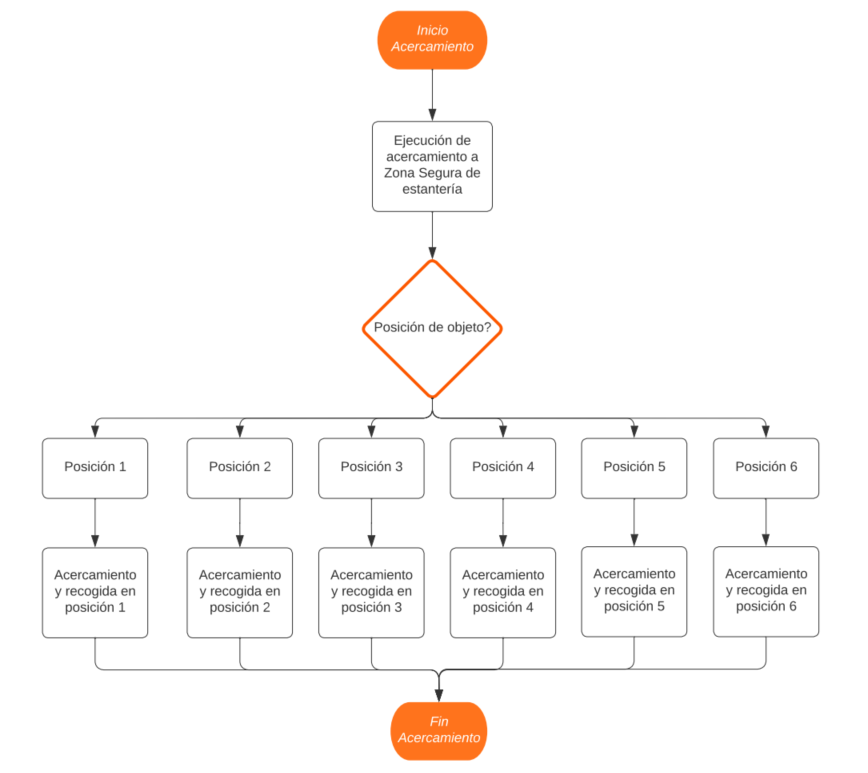
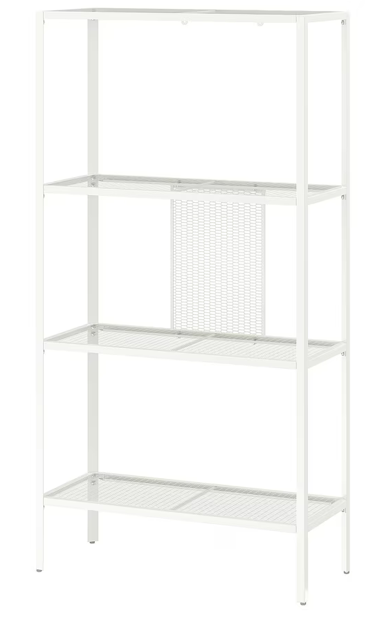
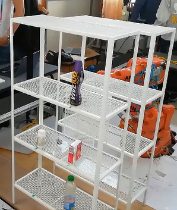

# Proyecto de Robótica 2023 - ABB Pick and Place
## Universidad Nacional de Colombia
### Robótica - 2023-II


## Integrantes
- Carlos Sánchez
- Manuel Carranza
- Eduardo Cuadros
- Victor Davila
- Oscar Restrepo
- Felipe Cruz Vásquez

## Contenido

En el repositorio de este proyecto se encuentra lo siguiente:
- README.md -> Archivo base con la descripción del proyecto.
- RobotStudio -> Carpeta que contiene los archivos de RobotStudio utilizados en el proyecto.
- Imgs -> Carpeta con imágenes utilizadas en el archivo README.

---
## Tabla de Contenidos

- [1. Introducción](#1-introducción)
- [2. Objetivos](#2-objetivos)
- [3. Proceso](#3-proceso)
- [4. Gripper](#4-gripper)
  - [4.1 Diseño](#41-diseño)
  - [4.2 Manufactura](#42-manufactura)
  - [4.3 Planos](#43-planos)
- [5. Acciones](#5-acciones)
  - [5.1 Diagrama de flujo](#51-diagrama-de-flujo)
- [6. Código RAPID](#6-código-rapid)
- [7. Alistamiento](#7-alistamiento)
  - [7.1 Elementos](#71-elementos)
  - [7.2 Ubicaciones](#72-ubicaciones)
- [8. Simulación RobotStudio](#8-simulación-robotstudio)
- [9. Resultado Final](#9-resultado-final)
  - [9.1 Video YouTube](#91-video-youtube)
- [10. Análisis de tiempos](#10-análisis-de-tiempos)
- [11. Conclusiones](#11-conclusiones)

## 1. Introducción
El Pick & place es la operación o tarea de recoger cosas de un lugar y colocarlas en otro. Este tipo de actividades se encuadran dentro de las actividades con una menor ergonomía de toda la cadena de producción, por lo que representan una carga extra, mental y física, para los trabajadores. Este tipo de tarea logística existe en casi todas las empresas manufactureras y, aunque se suelen asociar al final de la línea de producción, se pueden ver en mayor o menor medida en segmentos intermedios en algunas plantas.

En el presente proyecto del curso de Robótica de la Universidad Nacional de Colombia, sede Bogotá, se hace un acercamiento al proceso de automatización de procesos de Pick & Place empleando los robots industriales ABB presentes en el LabSIR. Se toman objetos de diferentes formas y en diferentes posiciones de un estante de 3 niveles y se colocan sobre una banda transportadora.

Este ejercicio implica el diseño y manufactura del efector final con un accionamiento neumático, así como la adquisición de los estantes, la codificación en RADIP de las respectivas rutinas del robot y su integración con una interfaz sobre el flexpendant para darle las instrucciones al robot.

A lo largo del documento se deja evidencia del proceso para lograr el cumplimiento de los objetivos propuesto, incluyendo videos de simulación y funcionamiento real.


## 2. Objetivos
-	Desarrollar un sistema robotizado para la automatización del proceso de Pick & Place y alistamiento de pedidos. 
-	Validar simulaciones de funcionamiento de un robot en actividades Pick & Place empleando el software RobotStudio
-	Diseñar una herramienta para pick and place de objetos con diferentes geometrías. 
-	Desarrollar una interfaz con la que un operario pueda darle instrucciones correctas al robot para el proceso de Pick & Place
-	Verificar el funcionamiento del código de programación de RAPID y el uso de la interfaz en el robot industrial del LabSIR
-	Usar sistemas electroneumáticos en conjunto con el sistema robótico del LabSIR

## 3. Proceso

#### 3.1 Definición del Problema

La problemática identificada en la industria, donde tareas manuales en el proceso de alistamiento de pedidos pueden ser optimizadas, sirvió como punto de partida. La pregunta clave fue formulada: "¿Cómo podemos lograr la automatización segura y eficiente del proceso de Pick & Place utilizando un brazo manipulador industrial?"

#### 3.2 Inspiración en el Amazon Packing Challenge

Inspirados en el Amazon Packing Challenge, especialmente en la versión simplificada detallada en el artículo "A Summary of MIT’s Approach to the Amazon Picking Challenge 2015", definimos nuestro objetivo: despachar un pedido de tres objetos dispuestos aleatoriamente en una estantería de 3 filas y 2 columnas.

#### 3.3 Diseño del Sistema Robotizado

Después de seleccionar el manipulador industrial ABB IRB 140, llevamos a cabo mediciones precisas y consideramos las dimensiones de la estantería BAGGEBO para garantizar un posicionamiento preciso de los objetos.

#### 3.4 Desarrollo del Gripper

Diseñamos un gripper personalizado, adaptado a nuestras necesidades específicas de agarre. Se seleccionaron válvulas electromecánicas para controlar las operaciones del gripper. Este fue fabricado mediante impresión 3D utilizando material TPU para lograr flexibilidad y resistencia.

#### 3.5 Alistamiento Manual y Análisis de Tiempos

Realizamos pruebas manuales para determinar el tiempo promedio de alistamiento en diversas combinaciones. La ubicación de la estantería y los objetos se ajustó manualmente al inicio del proceso, simulando las condiciones reales de operación.

#### 3.6 Programación del Sistema

El código RAPID fue desarrollado para definir las rutinas del robot, incluyendo las operaciones de agarre, traslado y depósito de objetos. Implementamos una interfaz humano-máquina utilizando ScreenMaker en RobotStudio para facilitar la interacción y selección de objetos.

#### 3.7 Integración y Pruebas Exhaustivas

Integramos todas las componentes del sistema, incluyendo el gripper, la estantería y la interfaz. Realizamos pruebas exhaustivas para validar el funcionamiento del sistema en diversos escenarios, asegurándonos de su eficacia y seguridad.

#### 3.8 Documentación y Presentación

Cuidadosamente documentamos cada fase del proyecto, destacando desafíos enfrentados y lecciones aprendidas. Preparamos un video de presentación que incluye la simulación en RobotStudio, la implementación del proyecto y una comparación de tiempos entre el alistamiento manual y el proceso automatizado.

## 4. Gripper

### 4.1 Diseño

En relación con el diseño del gripper, es pertinente señalar que se llevó a cabo una análisis de los elementos que requerían manipulación. Este análisis tuvo como objetivo optimizar la geometría del gripper, permitiendo al robot manipular los elementos de manera eficiente. En virtud de esta consideración, se optó por la implementación de un gripper doble, compuesto por una pinza de dos dedos y una ventosa neumática. Esta elección se fundamenta en la búsqueda de una mayor versatilidad, proporcionando al sistema la capacidad de abordar una amplia variedad de manipulaciones de acuerdo con los elementos descritos en la guía.


Conforme se evidencia en la imagen anterior, el modelado del Gripper se lleva a cabo a partir de un émbolo neumático como base, encargado de desencadenar el movimiento de dos articulaciones tipo bisagra. Estas articulaciones, a su vez, están vinculadas a los dedos responsables de entrar en contacto con los elementos que requieren manipulación. Adicionalmente, en uno de los costados del gripper, se encuentra anclada la ventosa encargada de generar succión para facilitar la manipulación de los elementos. Este diseño ofrece una solución integrada que optimiza la funcionalidad del gripper en términos de movilidad y capacidad de manipulación.

### 4.2 Manufactura

### 4.3 Planos

### 4.3.1 Plano Dedo


## 5. Acciones

### 5.1 Diagrama de flujo
A continuación se presentan los diferentes diagramas de flujo para cada una de las funciones del código de RAPID. 












## 6. Código RAPID

```
MODULE Module1
    ! Definimos los parámetros de las articulaciones que posicionan la estantería respecto al robot
    CONST num q1Estanteria:=0.27059805;
    CONST num q2Estanteria:=0.653281482;
    CONST num q3Estanteria:=0.27059805;
    CONST num q4Estanteria:=0.653281482;
    ! Definimos los parámetros de las articulaciones que posicionan la banda respecto al robot
    CONST num q1Banda:=0.653281482;
    CONST num q2Banda:=0.653281482;
    CONST num q3Banda:=-0.27059805;
    CONST num q4Banda:=0.27059805;
    ! Definimos la posición relativa del punto desde donde el robot inicia su acercamiento a la estantería
    CONST num lejaniaEstanteria:=545;
    ! Definimos las posiciones relativas de cada uno de los niveles respecto del robot
    CONST num zonaAlta:=902;
    CONST num zonaMedia:=558;
    CONST num zonaBaja:=241;
    ! Definimos las posiciones izquierda y derecha de la estantería en donde se colocan cada uno de los objetos
    CONST num zonaIzq:=119;
    CONST num zonaDer:=-92;
    ! Definimos la posición desde donde inicia el acercamiento del robot a la banda
    CONST num lejaniaBanda:=-388;
    ! Definimos la altura de la banda respecto del robot
    CONST num alturaBanda:=335;
    ! Definimos las tres posiciones de la banda en donde se colocaran los objetos 
    CONST num zonaBandaIzq:=136;
    CONST num zonaBandaCentro:=-72;
    CONST num zonaBandaDer:=-220;
    ! Definimos las distancias de acercamiento
    CONST num distanciaAcercar:=595 - 545;
    CONST num distanciaAcercarBanda:=520 - 388;
    ! La acción de la herramienta - abrir o cerrar
    CONST bool abrirGarra:=TRUE;
    
    ! Cinemática directa para las posiciones articulares de interés:
    ! El home del robot
    CONST jointtarget home:=[[0,-43,35,0,0,135],[9E+09,9E+09,9E+09,9E+09,9E+09,9E+09]];
    ! Las tres posiciones de la banda
    CONST jointtarget banda1:=[[-66,22,45,29,-66,127],[9E+09,9E+09,9E+09,9E+09,9E+09,9E+09]];
    CONST jointtarget banda2:=[[-90,22,44,3,-62,137],[9E+09,9E+09,9E+09,9E+09,9E+09,9E+09]];
    CONST jointtarget banda3:=[[-117,26,36,-28,-62,150],[9E+09,9E+09,9E+09,9E+09,9E+09,9E+09]];
    ! Las 6 posiciones en las cuales debe tomar cada objeto
    CONST jointtarget acercar1:=[[18,1,-27,-42,28,180],[9E+09,9E+09,9E+09,9E+09,9E+09,9E+09]];
    CONST jointtarget acercar2:=[[-10,-1,-25,24,24,122],[9E+09,9E+09,9E+09,9E+09,9E+09,9E+09]];
    CONST jointtarget acercar3:=[[23,0.5,23,53,-33,83],[9E+09,9E+09,9E+09,9E+09,9E+09,9E+09]];
    CONST jointtarget acercar4:=[[-12,-6,29,-26,-23,154],[9E+09,9E+09,9E+09,9E+09,9E+09,9E+09]];
    CONST jointtarget acercar5:=[[22,45,29,26,-73,123],[9E+09,9E+09,9E+09,9E+09,9E+09,9E+09]];
    CONST jointtarget acercar6:=[[-11,43,33,-9,-75,132],[9E+09,9E+09,9E+09,9E+09,9E+09,9E+09]];
    
    ! Posiciones absolutas (vistas por la base) de la estantería
    !  -----------
    ! |  1  |  2  |
    !  -----------
    ! |  3  |  4  |
    !  -----------
    ! |  5  |  6  |
    !  -----------
    ! Apoyados en las constantes previamente definidas se organiza las posiciones (x,y,z)
    ! de cada una de las posiciones de interés para la estantería
    CONST num x1:=lejaniaEstanteria;
    CONST num y1:=zonaIzq;
    CONST num z1:=zonaAlta;
    CONST num x2:=lejaniaEstanteria;
    CONST num y2:=zonaDer;
    CONST num z2:=zonaAlta;
    CONST num x3:=lejaniaEstanteria;
    CONST num y3:=zonaIzq;
    CONST num z3:=zonaMedia;
    CONST num x4:=lejaniaEstanteria;
    CONST num y4:=zonaDer;
    CONST num z4:=zonaMedia;
    CONST num x5:=lejaniaEstanteria;
    CONST num y5:=zonaIzq;
    CONST num z5:=zonaBaja;
    CONST num x6:=lejaniaEstanteria;
    CONST num y6:=zonaDer;
    CONST num z6:=zonaBaja;
    
    ! Posiciones absolutas (vistas por la base) de la banda
    !  -----------------
    ! |  1  |  2  |  3  |
    !  -----------------
    ! Apoyados en las constantes previamente definidas se organizan las posiciones (x,y,z) sobre la banda 
    CONST num xB1:=zonaBandaIzq;
    CONST num yB1:=lejaniaBanda;
    CONST num zB1:=alturaBanda;
    CONST num xB2:=zonaBandaCentro;
    CONST num yB2:=lejaniaBanda;
    CONST num zB2:=alturaBanda;
    CONST num xB3:=zonaBandaDer;
    CONST num yB3:=lejaniaBanda;
    CONST num zB3:=alturaBanda;
    
    ! Variables para control    
    PERS robtarget Target_Estanteria:=[[0,0,0],[0,0,0,0],[0,-1,1,0],[9E+9,9E+9,9E+9,9E+9,9E+9,9E+9]];
    PERS robtarget Target_Banda:=[[0,0,0],[0,0,0,0],[0,-1,1,0],[9E+9,9E+9,9E+9,9E+9,9E+9,9E+9]];
    PERS robtarget Target_Agarrar:=[[0,0,0],[0,0,0,0],[0,-2,1,0],[9E+09,9E+09,9E+09,9E+09,9E+09,9E+09]];
    PERS robtarget Target_Dejar:=[[0,0,0],[0,0,0,0],[0,-2,1,0],[9E+09,9E+09,9E+09,9E+09,9E+09,9E+09]];    
    PERS num posControl:=0;
    PERS string gripperOptions{2} := [ "Chupa", "Garra" ];
    PERS string gripperOption := "Chupa";
    PERS num objetosEnBanda:=0;
    PERS bool DO_Dejar:=FALSE;
    PERS bool DO_Home:=FALSE;
    PERS bool DO_IrHome:=FALSE;
    PERS bool DO_Mover:=FALSE;
    PERS bool DO_Recoger:=FALSE;
    PERS bool DO_STOP:=FALSE;
    
    PROC main()
        posControl:=0;
        WHILE TRUE DO
            ! valida si se da la instrucción de ir a home 
            IF DO_IrHome THEN
                ! Llama el procedimiento Homming
                Homming;
                DO_Home:=TRUE;
                DO_STOP:=FALSE;
                DO_IrHome:=FALSE;
            ENDIF
            ! Si no se le da instrucción de Ir a home va al procedimiento Tarea principal
            TareaPrincipal(posControl);
        ENDWHILE
    ENDPROC
    PROC Homming()
        ! Se envía la información a la interfaz
        TPWrite "INICIO: Homming";
        ! Lleva a home el robot
        MoveAbsJ home, v100, fine, tool0;
        ! Se lleva la información a la interfaz
        TPWrite "FIN: Homming";
    ENDPROC
    PROC AgarrarGarra()
        ! Enviamos información a la interfaz
        TPWrite "INICIO: AgarrarGarra";
        ! Se da la instrucción de recoger
        DO_Recoger:=TRUE;
        ! Se establecen las condiciones de las articulaciones para el agarre
        Target_Agarrar:=CRobT(\Tool:=tool0 \WObj:=wobj0);
        Target_Agarrar.trans.x:=Target_Agarrar.trans.x + distanciaAcercar;
        ! se le da la instrucción al robot para el agarre
        MoveL Target_Agarrar,v50,fine,tool0\WObj:=wobj0; 
        ControlGripper(abrirGarra);
        Target_Agarrar:=CRobT(\Tool:=tool0 \WObj:=wobj0);
        Target_Agarrar.trans.x:=Target_Agarrar.trans.x - distanciaAcercar;
        MoveL Target_Agarrar,v50,fine,tool0\WObj:=wobj0; 
        ! Se le indica al robot que debe soltar 
        DO_Recoger:=FALSE;
        ! Enviamos información a la interfaz
        TPWrite "FIN: AgarrarGarra";
    ENDPROC
    PROC AgarrarChupa()
        ! Enviamos información a la interfaz
        TPWrite "INICIO: AgarrarChupa";
        ! Se da la instrucción de recoger
        DO_Recoger:=TRUE;
        ! Se establecen las condiciones de las articulaciones para el agarre
        Target_Agarrar:=CRobT(\Tool:=tool0 \WObj:=wobj0);
        Target_Agarrar.trans.x:=Target_Agarrar.trans.x + distanciaAcercar;
        ! se le da la instrucción al robot para el agarre
        MoveL Target_Agarrar,v50,fine,tool0\WObj:=wobj0; 
        ! Se mantiene el griper cerrado
        ControlGripper(not abrirGarra);
        ! Se mueve el robot a la la posición donde deja el objeto
        Target_Agarrar:=CRobT(\Tool:=tool0 \WObj:=wobj0);
        Target_Agarrar.trans.x:=Target_Agarrar.trans.x - distanciaAcercar;
        MoveL Target_Agarrar,v50,fine,tool0\WObj:=wobj0; 
        ! Se le indica al robot que debe soltar 
        DO_Recoger:=FALSE;
        ! Enviamos información a la interfaz
        TPWrite "FIN: AgarrarChupa";
    ENDPROC
    PROC DejarGarra()
        TPWrite "INICIO: DejarGarra";
        DO_Dejar:=TRUE;
        Target_Dejar:=CRobT(\Tool:=tool0 \WObj:=wobj0);
        Target_Dejar.trans.y:=Target_Dejar.trans.y - distanciaAcercarBanda;
        MoveL Target_Dejar,v50,fine,tool0\WObj:=wobj0; 
        ControlGripper(not abrirGarra);
        Target_Dejar:=CRobT(\Tool:=tool0 \WObj:=wobj0);
        Target_Dejar.trans.y:=Target_Dejar.trans.y + distanciaAcercarBanda;
        MoveL Target_Dejar,v50,fine,tool0\WObj:=wobj0; 
        DO_Dejar:=FALSE;
        TPWrite "FIN: DejarGarra";
    ENDPROC
    PROC DejarChupa()
        TPWrite "INICIO: DejarChupa";
        DO_Dejar:=TRUE;
        Target_Dejar:=CRobT(\Tool:=tool0 \WObj:=wobj0);
        Target_Dejar.trans.y:=Target_Dejar.trans.y - distanciaAcercarBanda;
        MoveL Target_Dejar,v50,fine,tool0\WObj:=wobj0; 
        ControlGripper(abrirGarra);
        Target_Dejar:=CRobT(\Tool:=tool0 \WObj:=wobj0);
        Target_Dejar.trans.y:=Target_Dejar.trans.y + distanciaAcercarBanda;
        MoveL Target_Dejar,v50,fine,tool0\WObj:=wobj0; 
        DO_Dejar:=FALSE;
        TPWrite "FIN: DejarChupa";
    ENDPROC
    PROC ZonaSegura(num posEstanteria)
        ! Definimos una zona zegura en la que se puede mover el robot
        ! Depende de los 6 objetos que existen en la estantería
        ! Se inicia enviando información al HMI
        TPWrite "INICIO: ZonaSegura";
        IF posEstanteria = 1 THEN
            MoveAbsJ acercar1, v100, fine, tool0;
        ELSEIF posEstanteria = 2 THEN
            MoveAbsJ acercar2, v100, fine, tool0;
        ELSEIF posEstanteria = 3 THEN
            MoveAbsJ acercar3, v100, fine, tool0;
        ELSEIF posEstanteria = 4 THEN
            MoveAbsJ acercar4, v100, fine, tool0;
        ELSEIF posEstanteria = 5 THEN
            MoveAbsJ acercar5, v100, fine, tool0;
        ELSEIF posEstanteria = 6 THEN
            MoveAbsJ acercar6, v100, fine, tool0;
        ENDIF
        ! Se termina enviando la instrucción a la interfaz
        TPWrite "FIN: ZonaSegura";
    ENDPROC
     PROC ZonaSeguraBanda(num posBanda)
        ! Definimos una zona zegura en la que se puede mover el robot
        ! Depende de las 3 posiciones en las que se deja el objeto sobre la banda
        ! Se inicia enviando información al HMI
        TPWrite "INICIO: ZonaSeguraBanda";
        IF posBanda = 3 THEN
            MoveAbsJ banda1, v100, fine, tool0;
        ELSEIF posBanda = 2 THEN
            MoveAbsJ banda2, v100, fine, tool0;
        ELSEIF posBanda = 1 THEN
            MoveAbsJ banda3, v100, fine, tool0;
        ENDIF
        ! Se envía información a la interfaz de que se ha terminado el procedimiento
        TPWrite "FIN: ZonaSeguraBanda";
    ENDPROC
    PROC Acercar(num posEstanteria)
        ! Enviamos la información a la interfaz
        TPWrite "INICIO: Acercar";
        ! Establecemos la zona ZonaSegura según el objeto que se quiera tomar del estante
        ZonaSegura(posEstanteria);
        ! Se establecen las posiciones objetivo
        Target_Estanteria:=CRobT(\Tool:=tool0 \WObj:=wobj0);
        Target_Estanteria.rot.q1:=q1Estanteria;
        Target_Estanteria.rot.q2:=q2Estanteria;
        Target_Estanteria.rot.q3:=q3Estanteria;
        Target_Estanteria.rot.q4:=q4Estanteria;
        ! Seleccionamos la posición final según el objeto que se quiere tomar (1 al 6)
        IF posEstanteria = 1 THEN
            Target_Estanteria.trans.x:=x1;
            Target_Estanteria.trans.y:=y1;
            Target_Estanteria.trans.z:=z1;
        ELSEIF posEstanteria = 2 THEN
            Target_Estanteria.trans.x:=x2;
            Target_Estanteria.trans.y:=y2;
            Target_Estanteria.trans.z:=z2;
        ELSEIF posEstanteria = 3 THEN
            Target_Estanteria.trans.x:=x3;
            Target_Estanteria.trans.y:=y3;
            Target_Estanteria.trans.z:=z3;
        ELSEIF posEstanteria = 4 THEN
            Target_Estanteria.trans.x:=x4;
            Target_Estanteria.trans.y:=y4;
            Target_Estanteria.trans.z:=z4;
        ELSEIF posEstanteria = 5 THEN
            Target_Estanteria.trans.x:=x5;
            Target_Estanteria.trans.y:=y5;
            Target_Estanteria.trans.z:=z5;
        ELSEIF posEstanteria = 6 THEN
            Target_Estanteria.trans.x:=x6;
            Target_Estanteria.trans.y:=y6;
            Target_Estanteria.trans.z:=z6;
        ELSE
            ! Si se ha seleccionado un ojeto no permitido
            TPWrite "ERROR: posEstanteria inválido";
            RETURN;
        ENDIF
        ! Se le da la instrucción al robot de mover a la posición
        MoveJ Target_Estanteria,v50,fine,tool0\WObj:=wobj0;
        ! Enviamos la información a la interfaz.
        TPWrite "FIN: Acercar";
    ENDPROC
    PROC AcercarBanda(num posBanda)
        TPWrite "INICIO: AcercarBanda";
        ZonaSeguraBanda(posBanda);
        Target_Banda:=CRobT(\Tool:=tool0 \WObj:=wobj0);
        Target_Banda.rot.q1:=q1Banda;
        Target_Banda.rot.q2:=q2Banda;
        Target_Banda.rot.q3:=q3Banda;
        Target_Banda.rot.q4:=q4Banda;
        IF posBanda = 3 THEN
            Target_Banda.trans.x:=xB1;
            Target_Banda.trans.y:=yB1;
            Target_Banda.trans.z:=zB1;
        ELSEIF posBanda = 2 THEN
            Target_Banda.trans.x:=xB2;
            Target_Banda.trans.y:=yB2;
            Target_Banda.trans.z:=zB2;
        ELSEIF posBanda = 1 THEN
            Target_Banda.trans.x:=xB3;
            Target_Banda.trans.y:=yB3;
            Target_Banda.trans.z:=zB3;
        ELSE
            TPWrite "ERROR: posBanda inválido";
            RETURN;
        ENDIF
        MoveJ Target_Banda,v50,fine,tool0\WObj:=wobj0;
        TPWrite "FIN: AcercarBanda";
    ENDPROC
    PROC ControlGripper(bool abierto)
        IF abierto THEN
            Set DO_01;
            Reset DO_02;
        ELSE
            Set DO_02;
            Reset DO_01;
        ENDIF
    ENDPROC
    PROC TareaPrincipal(num posEstanteria)

        IF posEstanteria = 0 THEN
            RETURN;
        ENDIF
        ! Reescribimos variables de decisión
        DO_Home:=FALSE;
        DO_Mover:=TRUE;
        IF DO_STOP THEN
            ! Si se le da la instrucción de Parar no se debe mover y su posición de control debe ser la 0
            DO_Mover:=FALSE;
            posControl:=0;
            RETURN;
        ENDIF
        ! Nos acercamos a la estantería llamando al procedimiento Acercar
        Acercar(posEstanteria);
        ! Validamos si se le ha indicado que debe parar
        IF DO_STOP THEN
            DO_Mover:=FALSE;
            posControl:=0;
            RETURN;
        ENDIF
        ! Si se ha seleccionado el efector final como la chupa o la garra
        ! Se llama a la función que llama a la acción sobre el respectivo efector
        IF gripperOption = "Chupa" THEN
            AgarrarChupa;
        ELSEIF gripperOption = "Garra" THEN
            AgarrarGarra;
        ENDIF
        IF DO_STOP THEN
        ! Validamos si se le ha indicado que debe parar
            DO_Mover:=FALSE;
            posControl:=0;
            RETURN;
        ENDIF
        ! Coloca el robot en posicón de home
        Homming;
        ! Validamos si se le ha indicado que debe parar
        IF DO_STOP THEN
            DO_Mover:=FALSE;
            posControl:=0;
            RETURN;
        ENDIF
        !Acerca el robot a la banda
        AcercarBanda(objetosEnBanda + 1);
        ! Validamos si se le ha indicado que debe parar
        IF DO_STOP THEN
            DO_Mover:=FALSE;
            posControl:=0;
            RETURN;
        ENDIF
        ! Valida la opción de griper o chupa
        IF gripperOption = "Chupa" THEN
            DejarChupa;
        ELSEIF gripperOption = "Garra" THEN
            DejarGarra;
        ENDIF
        ! Validamos si se le ha indicado que debe parar
        IF DO_STOP THEN
            DO_Mover:=FALSE;
            posControl:=0;
            RETURN;
        ENDIF
        ! Volvemos a llevar el robot a home
        Homming;
        !Actualizamos las variables
        objetosEnBanda:=objetosEnBanda + 1;
        posControl:=0;
        DO_Mover:=FALSE;
        DO_Home:=TRUE;
    ENDPROC
ENDMODULE
```

### 7. Alistamiento

#### 7.1 Elementos

Antes de iniciar el proceso automatizado, es fundamental comprender la disposición y naturaleza de los elementos involucrados:

- **Estantería BAGGEBO:** La estantería consta de 6 posiciones designadas como 1, 2, 3, 4, 5, y 6, asignadas por pares en orden descendiente de los estantes. En cada posición se ubica una pieza a ser movida.



- **Objetos para la actividad de pick and place:** Se han seleccionado 3 tipos diferentes de objetos para este proyecto, que incluyen cajas, tarros, y botellas. La variabilidad en la geometría de estos objetos presenta un desafío interesante para el diseño y funcionalidad del gripper.


### 7.2 Ubicaciones

La ubicación precisa tanto de la estantería como de las piezas es esencial para el éxito del proceso automatizado. A continuación, se detallan las consideraciones clave:

- **Posicionamiento inicial:** Tanto la estantería como las piezas deben ser colocadas en el espacio de trabajo del manipulador. Se requiere un ajuste preciso utilizando el brazo inmóvil al inicio del proceso.

- **Alistamiento de la estantería:** Se deben ubicar 3 piezas distintas en 3 posiciones elegidas al azar para simular un escenario realista.

Estas ubicaciones deben ser cuidadosamente coordinadas para garantizar un proceso fluido y eficiente durante la ejecución del sistema robotizado. Cualquier ajuste adicional necesario debe realizarse con precaución, asegurando que el brazo manipulador permanezca inmóvil durante estos ajustes.

## 8. Simulación Robot Studio

## 9. Resultado Final

### 9.1 Video YouTube

## 10. Conclusiones
-	Se logró desarrollar un sistema robotizado para la automatización del proceso de Pick & Place y alistamiento de pedidos con objetos de diferentes formas ubicados en varias posiciones de una estantería y colocados en diferentes lugares sobre una banda transportador. 
-	Las simulaciones de funcionamiento del robot sobre RobotStudio, basados en los códigos desarrollados para el Pick & Place permitieron validar el correcto funcionamiento previo a su implementación en el robot industrial. 
-	Se aprovechó un diseño de un efector final neumático existente en el LabSIR para desarrollar una nueva herramienta mejorada con elementos flexibles que mejoran el agarre del efector final
-	Se implementó una interfaz gráfica sobre el flexpendant que permitió al operario seleccionar el objeto que se quería colocar y posicionarlo sobre la banda transportadora. Esto sólo se pudo hacer sobre un robot, ya que el otro robot no permitió el cargue de la información.
-	Se puso en funcionamiento el código de programación de RAPID y la interfaz gráfica en el robot industrial del LabSIR y se logró el cumplimiento del Pick & Place de los objetos. El diseño del efector final permitió este ejercicio con diferentes formas y texturas. Sin embargo, es necesario tener cuidado con los movimientos del robot para dejar el estante, ya que se debe considerar la altura del objeto para que no golpee con la lámina del nivel superior.
-	Se usaron los sistemas electroneumáticos en conjunto con el sistema robótico del LabSIR. Para ello se emplearon electroválvulas y circuitos neumáticos integrados con las salidas digitales del robot ABB:
